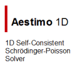

# Next in LRG 2024.
{: .fs-9 }

Consolidating Our Scientific Efforts.
{: .fs-6 .fw-300 }

[More information](docs/research/next-in-lrg){: .btn .btn-primary .fs-5 .mb-4 .mb-md-0 .mr-2 }

---

## News

### June 2024

* New version (v24.6.1) of *gpaw-tools* is released. It can be downloaded from *gpaw-tools* [repository](https://github.com/lrgresearch/gpaw-tools). Please refer to [release notes](https://www.lrgresearch.org/gpaw-tools/development/releasenotes/#version-2461).
* New version (v24.6.0) of *gpaw-tools* is released. It can be downloaded from *gpaw-tools* [repository](https://github.com/lrgresearch/gpaw-tools). Please refer to [release notes](https://www.lrgresearch.org/gpaw-tools/development/releasenotes/#version-2460).

### October 2023

*  On the 100th anniversary (Oct 29th, 2023) of our independent Turkish Republic, we commemorate with gratitude all our martyrs and veterans who enabled us to do science freely.
* A new article "[Electronic Properties of a Novel Boron Polymorph: Ogee-Borophene](https://doi.org/10.1155/2023/9933049)" is published in Adv. Condens. Matter Phys.
* New version (v23.10.0) of *gpaw-tools* is released. It can be downloaded from *gpaw-tools* [repository](https://github.com/lrgresearch/gpaw-tools). Please refer to [release notes](https://www.lrgresearch.org/gpaw-tools/development/releasenotes/#version-23100).

### July 2023

* New version (v23.7.0) of *gpaw-tools* is released. It can be downloaded from *gpaw-tools* [repository](https://github.com/lrgresearch/gpaw-tools). There are many new features in this version: Phonon calculations, energy consumption measurement, and more. Please refer to [release notes](https://www.lrgresearch.org/gpaw-tools/development/releasenotes/#version-2370).
* Tugce Han has finished her studies, passed her viva, and gained her title. Congratulations Tugce Han, MSc.

### June 2023

* M. Taha Haliloğlu joined our group once again for his doctoral study. Welcome back, Taha.
* A. Fatih Kuloglu joined our group once again for his doctoral study. Welcome back, Fatih.
* Umit Sahin joined our group for his doctoral study. Welcome Umit.

### March 2023

* A new article "[Structural and optical properties of mist-CVD grown MgZnO: Effect of precursor solution composition](https://doi.org/10.1016/j.physb.2023.414854)" is published in Physica B.
* A new article "[First principles calculations of electronic and optical properties of InSe nanosheets doped with noble metal atoms](https://doi.org/10.1016/j.commatsci.2023.112114)" is published in Comput. Mater. Sci.

### February 2023

* New version (v23.2.0) of *gpaw-tools* is released. It can be downloaded from *gpaw-tools* [repository](https://github.com/lrgresearch/gpaw-tools). You can find what's new on the [release notes](https://www.lrgresearch.org/gpaw-tools/development/releasenotes/#version-2320) page.
* Hakan Yakupoğlu has joined our group. Welcome, Hakan.

### October 2022

* A new article "[Effect of Sulfur Concentration on Structural, Optical and Electrical Properties of Cu2CoSnS4 Absorber Film for Photovoltaic devices](https://doi.org/10.1016/j.physb.2022.414424)" is published in Physica B.
* Volkan Uncu has joined our group. Welcome Volkan.

### August 2022

* Our website is renewed with [Just the Docs](https://github.com/just-the-docs/just-the-docs) theme. It is more responsive, detailed, and ordered now.
* A new article "[Morphological and optical characterizations of different ZnO nanostructures grown by mist-CVD](https://doi.org/10.1016/j.jlumin.2022.119158)" is published in J. Lumin.

### July 2022

* [Aestimo 1D version 3.0](https://www.aestimosolver.org/) is released. This is a major release nearly again 2 years later. Because the code base was complicated and the usage of Aestimo was hard to understand, this release is mostly a simplification and clean-up release. Please visit to [release notes](https://www.aestimosolver.org/releasenotes.html#v300-july-13-2022) for more information.
* New version (v22.7.0) of *gpaw-tools* is released. It can be downloaded from *gpaw-tools* [repository](https://github.com/lrgresearch/gpaw-tools). You can find what's new on the [release notes](https://www.lrgresearch.org/gpaw-tools/development/releasenotes/#version-2270) page.

### May 2022
* New version (v22.5.0) of *gpaw-tools* is released. It can be downloaded from *gpaw-tools* [repository](https://github.com/lrgresearch/gpaw-tools). You can find what's new on the [release notes](https://www.lrgresearch.org/gpaw-tools/development/releasenotes/#version-2250) page.

### April 2022

* Gazi University accepts our new project CuOxMIST: Ga2O3/Cu2O p-n junction production and related computational studies with p-type Cu2O semiconductor thin films grown by Mist-CVD". Congratulations.
* New version (v22.4.0) of *gpaw-tools* is released. It can be downloaded from *gpaw-tools* [repository](https://github.com/lrgresearch/gpaw-tools). You can find what's new on the [release notes](https://www.lrgresearch.org/gpaw-tools/development/releasenotes/#version-2240) page.
 
[more...](docs/archive/newsarchive.md)

## We are supporting...

 | [Download v.2.0](https://github.com/aestimosolver/aestimo/releases/download/v2.0/aestimo-v.2.0-master.zip)
 | [Download latest development release](https://github.com/lrgresearch/gpaw-tools/archive/refs/heads/main.zip)

We are actively supporting the development of the Aestimo 1D Self-consistent Schrödinger-Poisson solver and gpaw-tools UI/GUI for the ASE/GPAW calculator.

## Contributors of this site

<ul class="list-style-none">

  <li class="d-inline-block mr-1">
     
  </li>

</ul>
